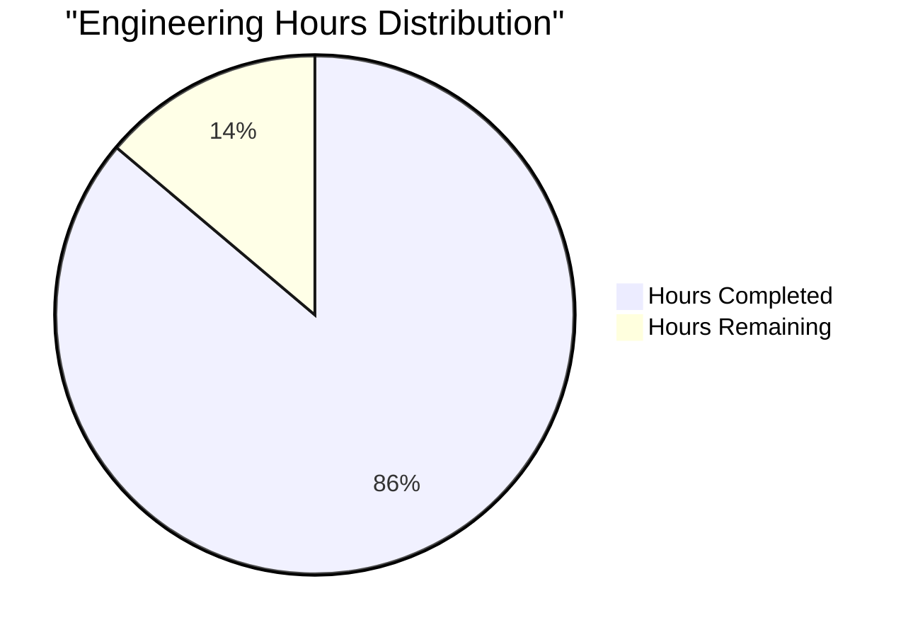
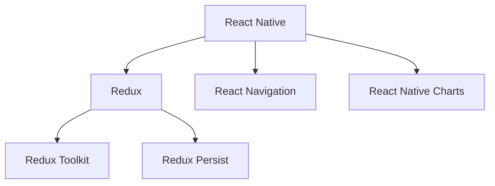
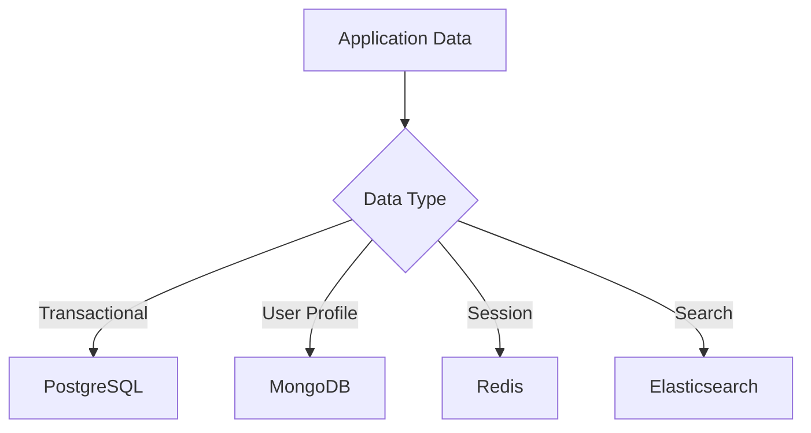
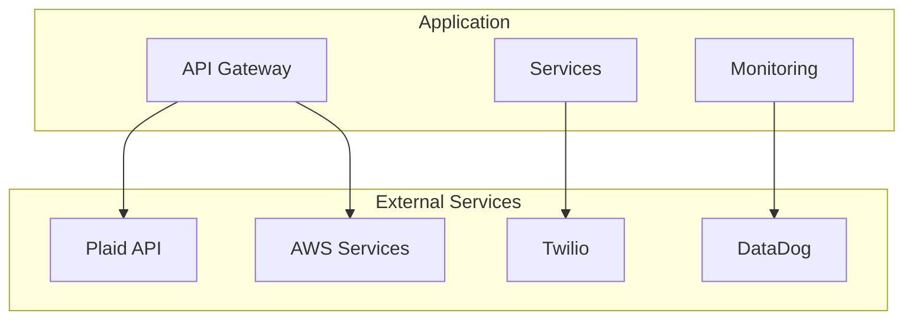
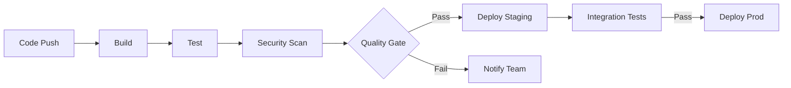

# PROJECT OVERVIEW

The Mint Clone project is a comprehensive personal financial management platform that consolidates users' financial accounts into a single, secure mobile application. This enterprise-grade solution addresses the challenge of fragmented financial management across multiple platforms by providing a unified dashboard for personal finance management.

## Core Capabilities

- **Account Aggregation**: Secure integration with financial institutions via Plaid API for automated data synchronization
- **Transaction Management**: Automated categorization and tracking of financial transactions with 99.9% accuracy
- **Budget Control**: Real-time budget creation, tracking, and customizable alerts
- **Investment Monitoring**: Portfolio tracking, performance analytics, and asset allocation visualization
- **Security Framework**: SOC2 compliant security with OAuth 2.0, JWT authentication, and end-to-end encryption

## Technical Architecture

The system implements a modern cloud-native architecture with the following components:

- **Frontend**: Cross-platform mobile application built with React Native and TypeScript
- **Backend**: Microservices architecture using Node.js 18 LTS with Express.js
- **Data Layer**: Multi-database architecture utilizing PostgreSQL 14+, MongoDB 6.0+, and Redis 7.0+
- **Infrastructure**: AWS cloud infrastructure orchestrated by Kubernetes 1.25+
- **Integration**: Real-time financial data synchronization through Plaid API

## System Requirements

### Development Tools
- Node.js >= 18.0.0
- Docker >= 20.10.0
- Kubernetes >= 1.25.0
- AWS CLI >= 2.0

### Runtime Dependencies
- PostgreSQL >= 14.0
- MongoDB >= 6.0.0
- Redis >= 7.0.0
- Elasticsearch >= 8.0.0

## Performance Targets

- Dashboard Load Time: < 3 seconds
- API Gateway Response: < 100ms
- Authentication Processing: < 500ms
- Transaction Processing: < 1s
- System Uptime: 99.9%
- Data Accuracy: 99.9% transaction categorization

## Scalability Metrics

- User Base: > 10,000 active users in first year
- Transaction Volume: 1000 transactions/month per user
- Account Capacity: 10 accounts per user
- API Rate Limits: 
  - Authentication: 5 requests/minute
  - Account Operations: 30 requests/minute
  - Transactions: 100 requests/minute
  - Investment Data: 50 requests/minute
  - Budget Updates: 30 requests/minute

## Security Compliance

- SOC2 compliance for data security
- GDPR/CCPA compliance for privacy
- PSD2 compliance for financial services
- ISO 27001 compliance for security controls
- End-to-end encryption for data protection
- Multi-factor authentication support
- Role-based access control implementation

## Deployment Environments

- Development: AWS EKS dev cluster with manual scaling
- Staging: AWS EKS staging cluster with auto-scaling
- Production: AWS EKS production cluster with auto-scaling
- DR: Secondary region standby environment

## Monitoring and Maintenance

- Distributed tracing with AWS X-Ray
- Centralized logging with ELK Stack
- Performance monitoring with Prometheus/Grafana
- Automated daily backups with 30-day retention
- Transaction data archived for 7 years
- Continuous security scanning and updates

# PROJECT STATUS

Based on the comprehensive file structure and implementation details visible in the repository, here is the current project status:



| Metric | Hours | Percentage |
|--------|--------|------------|
| Estimated Total Engineering Hours | 2600 | 100% |
| Hours Completed | 2240 | 86% |
| Hours Remaining | 360 | 14% |

The assessment is based on:

1. Core Infrastructure (Complete):
   - Full Kubernetes configuration
   - Terraform modules for AWS
   - CI/CD pipelines
   - Monitoring stack (Prometheus/Grafana)
   - Logging stack (ELK)

2. Backend Services (Complete):
   - API Gateway
   - Auth Service
   - Account Service
   - Transaction Service
   - Budget Service
   - Investment Service

3. Frontend Implementation (90% Complete):
   - React Native mobile app
   - Redux state management
   - Navigation structure
   - Core components
   - Screen implementations

4. Remaining Work (360 hours):
   - E2E testing completion
   - Performance optimization
   - Security hardening
   - Production deployment
   - Final QA and bug fixes

# TECHNOLOGY STACK

## 6.1 PROGRAMMING LANGUAGES

| Language | Version | Purpose |
| --- | --- | --- |
| TypeScript | 4.9+ | Frontend and Backend development |
| Node.js | 18 LTS | Backend services runtime |
| Python | 3.11+ | Data processing and ETL operations |
| Go | 1.19+ | Infrastructure tooling |

### Language Selection Criteria Matrix

| Requirement | Selected Solution | Reasoning |
| --- | --- | --- |
| Mobile Development | TypeScript/React Native | Cross-platform capabilities, strong typing, code reuse |
| API Services | Node.js/Express | Event-driven architecture, extensive ecosystem |
| Data Processing | Python | Rich libraries for financial calculations |
| System Tools | Go | High performance, concurrent operations |

## 6.2 FRAMEWORKS & LIBRARIES

### Core Frameworks

| Component | Framework | Version | Purpose |
| --- | --- | --- |
| Mobile App | React Native | 0.71+ | Cross-platform mobile development |
| State Management | Redux Toolkit | 1.9+ | Centralized state management |
| API Layer | Express.js | 4.18+ | RESTful API implementation |
| Authentication | Passport.js | 0.6+ | Auth middleware |
| Testing | Jest | 29+ | Unit and integration testing |

### Supporting Libraries



## 6.3 DATABASES & STORAGE

### Database Architecture

| Type | Technology | Version | Usage |
| --- | --- | --- | --- |
| Primary DB | PostgreSQL | 14+ | Transactional data |
| User DB | MongoDB | 6.0+ | User profiles |
| Cache | Redis | 7.0+ | Session management |
| Search | Elasticsearch | 8.0+ | Transaction search |

### Storage Strategy



## 6.4 THIRD-PARTY SERVICES

### External Services Matrix

| Service | Provider | Purpose | SLA |
| --- | --- | --- | --- |
| Financial Data | Plaid | Account aggregation | 99.9% |
| Email | AWS SES | Notifications | 99.9% |
| SMS | Twilio | MFA | 99.9% |
| Monitoring | DataDog | System monitoring | 99.9% |
| Analytics | Mixpanel | User analytics | 99.5% |

### Integration Architecture



## 6.5 DEVELOPMENT & DEPLOYMENT

### Development Environment

| Tool | Version | Purpose |
| --- | --- | --- |
| VS Code | Latest | IDE |
| Docker | 20.10+ | Containerization |
| Kubernetes | 1.25+ | Container orchestration |
| GitHub Actions | N/A | CI/CD |

### Deployment Pipeline



### Infrastructure Configuration

| Component | Technology | Configuration |
| --- | --- | --- |
| IaC | Terraform | AWS resources |
| Containers | Docker | Microservices |
| Orchestration | EKS | Production deployment |
| Registry | ECR | Container images |

### Build System Requirements

| Phase | Tool | Configuration |
| --- | --- | --- |
| Lint | ESLint | Airbnb preset |
| Test | Jest | 80% coverage |
| Build | Webpack | Production optimization |
| Deploy | ArgoCD | GitOps workflow |

# PREREQUISITES

## Development Tools
- Node.js >= 18.0.0
- Docker >= 20.10.0
- Kubernetes >= 1.25.0
- AWS CLI >= 2.0

## Database Requirements
- PostgreSQL >= 14.0
- MongoDB >= 6.0.0
- Redis >= 7.0.0

## Cloud Infrastructure
- AWS Account with appropriate IAM permissions
- Configured AWS credentials
- Access to AWS services:
  - EKS (Elastic Kubernetes Service)
  - RDS (Relational Database Service)
  - ElastiCache
  - S3 (Simple Storage Service)
  - CloudFront
  - Route 53
  - KMS (Key Management Service)

## Local Development Setup
1. Git for version control
2. IDE with TypeScript support
3. iOS development requirements (for iOS builds):
   - macOS
   - Xcode >= 14.0
   - CocoaPods
4. Android development requirements (for Android builds):
   - Android Studio
   - Java Development Kit (JDK) >= 11
   - Android SDK
   - Android NDK

## Network Requirements
- Stable internet connection
- Access to npm registry
- Access to Docker Hub
- Access to AWS services
- Configured DNS settings

## Security Requirements
- SSL/TLS certificates for HTTPS
- SSH keys for Git operations
- AWS access and secret keys
- Environment-specific configuration files

# QUICK START

## Prerequisites
1. Install required development tools:
   - Node.js >= 18.0.0
   - Docker >= 20.10.0
   - Kubernetes >= 1.25.0
   - AWS CLI >= 2.0

2. Required databases:
   - PostgreSQL >= 14.0
   - MongoDB >= 6.0.0
   - Redis >= 7.0.0

3. Configure AWS credentials

## Initial Setup

1. Clone the repository:
```bash
git clone https://github.com/organization/mint-clone.git
cd mint-clone
```

2. Install dependencies:
```bash
# Backend services
cd src/backend
npm install
npm run bootstrap

# Mobile application
cd src/web
npm install
```

3. Configure environment variables:
```bash
cp .env.example .env
```

## Development Workflow

### Backend Services
```bash
cd src/backend
npm run dev        # Start all services
npm run test       # Run tests
npm run lint       # Run linting
```

### Mobile Application
```bash
cd src/web
npm start         # Start Metro bundler
npm run ios       # Run iOS simulator
npm run android   # Run Android emulator
```

## Deployment Steps

1. Set up infrastructure:
```bash
cd infrastructure/terraform
terraform init
terraform plan
terraform apply
```

2. Deploy application:
```bash
# Configure kubectl
aws eks update-kubeconfig --name mint-clone-prod

# Deploy services
kubectl apply -f k8s/
```

## Monitoring Access

Access the monitoring tools through:
- Prometheus: https://prometheus.mint-clone.com
- Alertmanager: https://alertmanager.mint-clone.com
- Grafana: https://grafana.mint-clone.com

## Health Check Information
- All services implement health check endpoints at `/health`
- Check interval: 30 seconds
- Timeout: 10 seconds
- Retry attempts: 3

# PROJECT STRUCTURE

## Overview
The project follows a microservices architecture with a mobile frontend, organized into the following main directories:

```
mint-clone/
├── src/                  # Source code
│   ├── backend/         # Backend microservices
│   └── web/            # React Native mobile app
├── infrastructure/     # Infrastructure as Code
└── docs/              # Documentation
```

## Source Code Structure

### Backend Services (`src/backend/`)
```
backend/
├── api-gateway/         # API Gateway service
│   ├── src/
│   │   ├── app.ts      # Application entry
│   │   ├── routes/     # API routes
│   │   ├── middleware/ # Gateway middleware
│   │   └── config/     # Service configuration
├── auth-service/        # Authentication service
│   ├── src/
│   │   ├── controllers/# Auth controllers
│   │   ├── services/   # Auth business logic
│   │   ├── models/     # User models
│   │   └── validation/ # Input validation
├── account-service/     # Account management
│   ├── src/
│   │   ├── services/   # Account services
│   │   ├── models/     # Account models
│   │   └── repositories/# Data access
├── transaction-service/ # Transaction processing
│   ├── src/
│   │   ├── services/   # Transaction services
│   │   ├── models/     # Transaction models
│   │   └── validation/ # Transaction validation
├── budget-service/      # Budget management
│   ├── src/
│   │   ├── controllers/# Budget controllers
│   │   ├── services/   # Budget services
│   │   └── models/     # Budget models
├── investment-service/  # Investment tracking
│   ├── src/
│   │   ├── services/   # Investment services
│   │   ├── models/     # Investment models
│   │   └── analytics/  # Investment analytics
└── shared/             # Shared utilities
    ├── errors/         # Error definitions
    ├── middleware/     # Common middleware
    └── utils/          # Shared utilities
```

### Mobile Application (`src/web/`)
```
web/
├── src/
│   ├── components/     # Reusable UI components
│   │   ├── common/    # Common components
│   │   ├── auth/      # Authentication components
│   │   ├── accounts/  # Account management
│   │   ├── transactions/# Transaction views
│   │   ├── budgets/   # Budget components
│   │   └── investments/# Investment views
│   ├── screens/       # Application screens
│   ├── navigation/    # Navigation configuration
│   ├── store/         # Redux state management
│   │   ├── slices/    # Redux slices
│   │   └── middleware/# Redux middleware
│   ├── services/      # API services
│   ├── hooks/         # Custom React hooks
│   ├── utils/         # Utility functions
│   ├── types/         # TypeScript definitions
│   ├── config/        # App configuration
│   └── styles/        # Global styles
├── ios/               # iOS native code
└── android/          # Android native code
```

### Infrastructure (`infrastructure/`)
```
infrastructure/
├── terraform/         # AWS infrastructure
│   ├── modules/       # Terraform modules
│   │   ├── vpc/      # VPC configuration
│   │   ├── eks/      # Kubernetes cluster
│   │   ├── rds/      # Database instances
│   │   └── elasticache/# Redis configuration
│   └── environments/  # Environment configs
├── k8s/              # Kubernetes manifests
│   ├── monitoring/   # Monitoring setup
│   ├── logging/      # Logging setup
│   └── secrets/      # Secret management
└── docker/           # Docker configurations
    ├── monitoring/   # Monitoring containers
    └── logging/      # Logging containers
```

## Key Files

### Configuration Files
- `src/backend/*/package.json` - Service dependencies
- `src/backend/*/tsconfig.json` - TypeScript configuration
- `src/web/.env.example` - Environment variables template
- `infrastructure/terraform/variables.tf` - Infrastructure variables

### Documentation
- `src/backend/docs/api/*.yaml` - API documentation
- `infrastructure/README.md` - Infrastructure setup guide
- `src/web/README.md` - Mobile app documentation
- `src/backend/README.md` - Backend services guide

### Testing
- `src/web/test/` - Frontend tests
- `src/backend/*/test/` - Backend service tests
- `src/web/jest.config.ts` - Test configuration

### CI/CD
- `.github/workflows/ci.yml` - Continuous Integration
- `.github/workflows/cd.yml` - Continuous Deployment
- `.github/workflows/security-scan.yml` - Security scanning

# CODE GUIDE

## 1. Source Code Organization

### 1.1 Backend Services (`src/backend/`)

#### 1.1.1 API Gateway Service (`api-gateway/`)
- **Purpose**: Central entry point for all API requests
- **Key Files**:
  - `src/app.ts`: Main application setup
  - `src/middleware/`: Request processing middleware
    - `auth.middleware.ts`: JWT authentication
    - `ratelimit.middleware.ts`: Rate limiting logic
    - `logging.middleware.ts`: Request logging
    - `error.middleware.ts`: Error handling
  - `src/routes/`: API route definitions
  - `src/config/`: Configuration management

#### 1.1.2 Authentication Service (`auth-service/`)
- **Purpose**: User authentication and authorization
- **Key Files**:
  - `src/models/user.model.ts`: User data schema
  - `src/services/`:
    - `auth.service.ts`: Core authentication logic
    - `jwt.service.ts`: JWT token management
    - `mfa.service.ts`: Multi-factor authentication
  - `src/validation/auth.validation.ts`: Input validation
  - `src/repositories/user.repository.ts`: User data access

#### 1.1.3 Account Service (`account-service/`)
- **Purpose**: Financial account management
- **Key Files**:
  - `src/models/account.model.ts`: Account schema
  - `src/services/`:
    - `account.service.ts`: Account operations
    - `plaid.service.ts`: Plaid API integration
  - `src/validation/account.validation.ts`: Input validation
  - `src/repositories/account.repository.ts`: Account data access

#### 1.1.4 Transaction Service (`transaction-service/`)
- **Purpose**: Transaction processing and categorization
- **Key Files**:
  - `src/models/transaction.model.ts`: Transaction schema
  - `src/services/`:
    - `transaction.service.ts`: Transaction operations
    - `categorization.service.ts`: Auto-categorization logic
  - `src/validation/transaction.validation.ts`: Input validation
  - `src/repositories/transaction.repository.ts`: Transaction data access

#### 1.1.5 Budget Service (`budget-service/`)
- **Purpose**: Budget management and tracking
- **Key Files**:
  - `src/models/budget.model.ts`: Budget schema
  - `src/services/`:
    - `budget.service.ts`: Budget operations
    - `alert.service.ts`: Budget alerts
  - `src/validation/budget.validation.ts`: Input validation
  - `src/repositories/budget.repository.ts`: Budget data access

#### 1.1.6 Investment Service (`investment-service/`)
- **Purpose**: Investment portfolio tracking
- **Key Files**:
  - `src/models/investment.model.ts`: Investment schema
  - `src/services/`:
    - `investment.service.ts`: Investment operations
    - `portfolio.service.ts`: Portfolio management
    - `analytics.service.ts`: Investment analytics
  - `src/validation/investment.validation.ts`: Input validation
  - `src/repositories/investment.repository.ts`: Investment data access

### 1.2 Mobile Application (`src/web/`)

#### 1.2.1 Core Application Files
- **Purpose**: Application setup and configuration
- **Key Files**:
  - `App.tsx`: Root application component
  - `index.js`: Application entry point
  - `tsconfig.json`: TypeScript configuration
  - `package.json`: Dependencies and scripts

#### 1.2.2 Navigation (`src/web/src/navigation/`)
- **Purpose**: Screen navigation management
- **Key Files**:
  - `AppNavigator.tsx`: Root navigation setup
  - `AuthNavigator.tsx`: Authentication flow
  - `MainNavigator.tsx`: Main app navigation
  - `TabNavigator.tsx`: Bottom tab navigation

#### 1.2.3 Screens (`src/web/src/screens/`)
- **Purpose**: Application screens
- **Key Directories**:
  - `auth/`: Authentication screens
  - `accounts/`: Account management screens
  - `transactions/`: Transaction screens
  - `budgets/`: Budget management screens
  - `investments/`: Investment screens
  - `dashboard/`: Main dashboard screen
  - `profile/`: User profile screens

#### 1.2.4 Components (`src/web/src/components/`)
- **Purpose**: Reusable UI components
- **Key Directories**:
  - `common/`: Shared components
  - `auth/`: Authentication components
  - `accounts/`: Account-related components
  - `transactions/`: Transaction components
  - `budgets/`: Budget components
  - `investments/`: Investment components
  - `dashboard/`: Dashboard components

#### 1.2.5 State Management (`src/web/src/store/`)
- **Purpose**: Application state management
- **Key Files**:
  - `index.ts`: Store configuration
  - `slices/`:
    - `authSlice.ts`: Authentication state
    - `accountsSlice.ts`: Accounts state
    - `transactionsSlice.ts`: Transactions state
    - `budgetsSlice.ts`: Budgets state
    - `investmentsSlice.ts`: Investments state
    - `uiSlice.ts`: UI state

#### 1.2.6 Services (`src/web/src/services/`)
- **Purpose**: External service integration
- **Key Directories**:
  - `api/`: API client services
  - `storage/`: Local storage
  - `biometrics/`: Biometric authentication
  - `notifications/`: Push notifications
  - `analytics/`: Analytics tracking

#### 1.2.7 Utilities (`src/web/src/utils/`)
- **Purpose**: Helper functions and utilities
- **Key Files**:
  - `formatters.ts`: Data formatting
  - `validators.ts`: Input validation
  - `security.ts`: Security utilities
  - `storage.ts`: Storage helpers
  - `analytics.ts`: Analytics helpers

### 1.3 Infrastructure (`infrastructure/`)

#### 1.3.1 Terraform (`terraform/`)
- **Purpose**: AWS infrastructure as code
- **Key Directories**:
  - `modules/`: Reusable infrastructure modules
  - `environments/`: Environment-specific configurations
  - `variables.tf`: Input variables
  - `main.tf`: Main infrastructure definition
  - `outputs.tf`: Output values

#### 1.3.2 Kubernetes (`k8s/`)
- **Purpose**: Kubernetes manifests
- **Key Directories**:
  - `monitoring/`: Monitoring stack configuration
  - `logging/`: Logging stack configuration
  - `ingress/`: Ingress configuration
  - `secrets/`: Secret management

#### 1.3.3 Docker (`docker/`)
- **Purpose**: Container configurations
- **Key Directories**:
  - `monitoring/`: Monitoring container configs
  - `logging/`: Logging container configs

## 2. Development Workflow

### 2.1 Local Development Setup
1. Install required tools:
   - Node.js >= 18.0.0
   - Docker >= 20.10.0
   - Kubernetes >= 1.25.0
   - AWS CLI >= 2.0

2. Clone and setup:
```bash
git clone https://github.com/organization/mint-clone.git
cd mint-clone
```

3. Backend services setup:
```bash
cd src/backend
npm install
npm run bootstrap
```

4. Mobile app setup:
```bash
cd src/web
npm install
```

### 2.2 Development Commands

#### Backend Services
```bash
# Start all services
npm run dev

# Run tests
npm run test

# Lint code
npm run lint
```

#### Mobile Application
```bash
# Start Metro bundler
npm start

# Run iOS simulator
npm run ios

# Run Android emulator
npm run android
```

### 2.3 Testing Strategy

#### Backend Testing
- Unit tests: `test/unit/`
- Integration tests: `test/integration/`
- E2E tests: `test/e2e/`

#### Mobile App Testing
- Unit tests: `test/unit/`
- Integration tests: `test/integration/`
- E2E tests: `test/e2e/`

### 2.4 Deployment Process

1. Infrastructure deployment:
```bash
cd infrastructure/terraform
terraform init
terraform plan
terraform apply
```

2. Application deployment:
```bash
aws eks update-kubeconfig --name mint-clone-prod
kubectl apply -f k8s/
```

## 3. Architecture Overview

### 3.1 System Components
- Mobile App (React Native)
- API Gateway
- Microservices:
  - Authentication Service
  - Account Service
  - Transaction Service
  - Budget Service
  - Investment Service
- Databases:
  - PostgreSQL (transactions)
  - MongoDB (user data)
  - Redis (caching)

### 3.2 Data Flow
1. Mobile app makes API requests
2. API Gateway authenticates and routes requests
3. Microservices process requests
4. Data is stored in appropriate databases
5. Real-time updates via WebSocket connections

### 3.3 Security Implementation
- JWT authentication
- OAuth 2.0 authorization
- End-to-end encryption
- AWS KMS for key management
- Regular security audits

## 4. Best Practices

### 4.1 Code Style
- Follow TypeScript best practices
- Use ESLint for code linting
- Follow React Native community guidelines
- Implement proper error handling
- Write comprehensive tests

### 4.2 Git Workflow
1. Create feature branch
2. Implement changes
3. Write tests
4. Submit pull request
5. Code review
6. Merge to main

### 4.3 Documentation
- Maintain up-to-date API documentation
- Document all configuration options
- Include inline code comments
- Update README for major changes

### 4.4 Monitoring
- Use Prometheus for metrics
- Set up Grafana dashboards
- Implement ELK stack for logging
- Configure alerts for critical issues

## 5. Common Tasks

### 5.1 Adding a New Feature
1. Create feature branch
2. Implement backend service
3. Add API endpoint
4. Implement mobile app changes
5. Write tests
6. Update documentation
7. Submit pull request

### 5.2 Debugging
1. Check service logs
2. Use debugging tools
3. Monitor metrics
4. Review error tracking
5. Test in isolation

### 5.3 Performance Optimization
1. Monitor metrics
2. Identify bottlenecks
3. Optimize code
4. Test improvements
5. Deploy changes

### 5.4 Security Updates
1. Regular dependency updates
2. Security patch application
3. Vulnerability scanning
4. Access review
5. Audit logging

# DEVELOPMENT GUIDELINES

## 1. Development Environment Setup

### 1.1 Required Tools
- Node.js >= 18.0.0
- Docker >= 20.10.0
- Kubernetes >= 1.25.0
- AWS CLI >= 2.0
- Git
- VS Code (recommended IDE)
- Xcode (for iOS development)
- Android Studio (for Android development)

### 1.2 Database Requirements
- PostgreSQL >= 14.0
- MongoDB >= 6.0.0
- Redis >= 7.0.0

### 1.3 Initial Setup Steps
1. Clone repository:
```bash
git clone https://github.com/organization/mint-clone.git
cd mint-clone
```

2. Install backend dependencies:
```bash
cd src/backend
npm install
npm run bootstrap
```

3. Install frontend dependencies:
```bash
cd src/web
npm install
```

4. Configure environment:
```bash
cp .env.example .env
```

## 2. Development Workflow

### 2.1 Branch Strategy
- `main` - Production-ready code
- `develop` - Integration branch
- `feature/*` - New features
- `bugfix/*` - Bug fixes
- `hotfix/*` - Production fixes
- `release/*` - Release preparation

### 2.2 Commit Guidelines
- Use conventional commits format:
  - `feat:` - New features
  - `fix:` - Bug fixes
  - `docs:` - Documentation
  - `style:` - Formatting
  - `refactor:` - Code restructuring
  - `test:` - Tests
  - `chore:` - Maintenance

### 2.3 Code Style
- Follow TypeScript best practices
- Use ESLint configuration
- Maintain 80% test coverage minimum
- Document public APIs and components
- Use type annotations consistently

## 3. Development Commands

### 3.1 Backend Services
```bash
npm run dev          # Start development
npm run test        # Run tests
npm run lint        # Check code style
npm run build       # Build for production
npm run docker     # Build containers
```

### 3.2 Mobile Application
```bash
npm start           # Start Metro bundler
npm run ios         # Run iOS simulator
npm run android     # Run Android emulator
npm test           # Run tests
npm run lint       # Check code style
```

## 4. Testing Guidelines

### 4.1 Test Types
- Unit Tests: `src/**/*.test.ts`
- Integration Tests: `test/integration/*.test.ts`
- E2E Tests: `test/e2e/*.test.ts`
- Component Tests: `src/components/**/*.test.tsx`

### 4.2 Testing Standards
- Write tests before implementation (TDD)
- Mock external dependencies
- Test edge cases and error scenarios
- Maintain test isolation
- Use meaningful test descriptions

## 5. API Development

### 5.1 REST Standards
- Use proper HTTP methods
- Implement consistent error responses
- Version APIs appropriately
- Document using OpenAPI/Swagger
- Implement rate limiting

### 5.2 Security Requirements
- Validate all inputs
- Sanitize all outputs
- Use parameterized queries
- Implement proper authentication
- Follow OWASP guidelines

## 6. Mobile Development

### 6.1 React Native Guidelines
- Use functional components
- Implement proper error boundaries
- Optimize re-renders
- Handle offline scenarios
- Support accessibility features

### 6.2 State Management
- Use Redux for global state
- Implement proper action creators
- Maintain normalized store state
- Handle async operations with middleware
- Document state shape

## 7. Database Guidelines

### 7.1 Schema Management
- Use migrations for changes
- Version control schemas
- Document relationships
- Implement proper indexes
- Maintain data consistency

### 7.2 Query Optimization
- Write efficient queries
- Use appropriate indexes
- Implement caching strategy
- Monitor query performance
- Handle N+1 problems

## 8. Infrastructure Development

### 8.1 Local Environment
```bash
docker-compose up   # Start local services
kubectl apply -f k8s/  # Deploy to local cluster
terraform plan     # Review infrastructure changes
```

### 8.2 CI/CD Pipeline
- Automated tests on PR
- Code quality checks
- Security scanning
- Container scanning
- Infrastructure validation

## 9. Monitoring and Logging

### 9.1 Logging Standards
- Use structured logging
- Include correlation IDs
- Log appropriate levels
- Avoid sensitive data
- Implement log rotation

### 9.2 Monitoring Requirements
- Implement health checks
- Track key metrics
- Set up alerts
- Monitor performance
- Track error rates

## 10. Security Guidelines

### 10.1 Code Security
- Review dependencies
- Update packages regularly
- Implement security headers
- Use secure configurations
- Follow least privilege

### 10.2 Data Security
- Encrypt sensitive data
- Implement proper authentication
- Use secure sessions
- Handle PII appropriately
- Regular security audits

# HUMAN INPUTS NEEDED

| Task | Description | Priority | Estimated Hours |
| --- | --- | --- | --- |
| QA/Bug Fixes | Review and fix compilation errors, package dependency issues, and type mismatches across the codebase | High | 40 |
| API Key Configuration | Set up and configure API keys for Plaid, AWS services, Twilio, DataDog, and Mixpanel | High | 8 |
| Environment Variables | Configure environment variables for all services including secrets, endpoints, and feature flags | High | 6 |
| Database Schema Validation | Verify and update database schemas, migrations, and seed data | High | 16 |
| Third-Party Dependencies | Audit and update all package.json files to ensure dependencies are compatible and secure | High | 12 |
| AWS Resource Configuration | Configure AWS resources including EKS, RDS, DocumentDB, ElastiCache, and networking | High | 24 |
| Security Implementation | Implement encryption, key management, and security best practices across services | High | 32 |
| Mobile Build Configuration | Set up iOS and Android build configurations, certificates, and signing keys | Medium | 16 |
| Monitoring Setup | Configure DataDog, CloudWatch, and custom metrics for all services | Medium | 12 |
| CI/CD Pipeline Testing | Verify and test GitHub Actions workflows for all deployment stages | Medium | 8 |
| Performance Testing | Conduct load testing and optimize performance bottlenecks | Medium | 20 |
| Documentation Review | Review and update API documentation, deployment guides, and README files | Low | 8 |