# Technical Specifications

# 1. INTRODUCTION

## 1.1 EXECUTIVE SUMMARY

The 'Mint' Mobile App Replica project aims to develop a comprehensive personal financial management platform that consolidates users' financial accounts into a single, secure mobile application.

| Component | Description |
| --- | --- |
| Business Problem | Fragmented financial management across multiple platforms leading to poor financial visibility and control. |
| Target Users | Individual consumers managing personal finances and investments. |
| Key Stakeholders | End users, Financial institutions, Development team, and Security compliance officers. |
| Value Proposition | All-in-one financial dashboard with automated tracking, budgeting tools, and investment monitoring. |

## 1.2 SYSTEM OVERVIEW

### Project Context

| Aspect | Details |
| --- | --- |
| Market Position | Consumer fintech applications competing in the  personal financial management space. |
| Current Limitations | Disconnected financial accounts, manual tracking, and limited investment insights. |
| Enterprise Integration | Plaid API is used for financial institution connectivity, and Cloud infrastructure is used for scalability. |

### High-Level Description

| Component | Implementation |
| --- | --- |
| Primary Capabilities | Account aggregation, transaction categorization, budgeting, investment tracking. |
| Architecture | Cross-platform mobile app with RESTful API backend. |
| System Components | Mobile frontend, API backend, data storage, integration layer. |
| Technical Approach | Cloud-hosted, microservices architecture, real-time data synchronization. |

### Success Criteria

| Metric | Target |
| --- | --- |
| User Adoption | \>10,000 active users in first year |
| System Performance | \<3 second dashboard load time |
| Data Accuracy | 99.9% transaction categorization accuracy |
| System Uptime | 99.9% availability |

## 1.3 SCOPE

### In-Scope Elements

#### Core Features

- Secure user authentication and authorization
- Financial account aggregation and synchronization
- Automated transaction categorization
- Budget creation and tracking
- Investment portfolio monitoring
- Financial goal setting and tracking
- Real-time alerts and notifications

#### Implementation Boundaries

| Boundary Type | Coverage |
| --- | --- |
| System | iOS and Android mobile applications |
| Users | Individual consumers |
| Geography | United States market |
| Data Domains | Banking, credit cards, investments |

### Out-of-Scope Elements

- Business or enterprise accounts
- International markets and currencies
- Tax preparation features
- Direct payment processing
- Cryptocurrency tracking
- Financial advisor services
- Loan origination
- Insurance products
- Bill payment services
- Credit score monitoring

# 2. PRODUCT REQUIREMENTS

## 2.1 FEATURE CATALOG

### Authentication & Security Features

| ID | Feature Name | Category | Priority | Status |
| --- | --- | --- | --- | --- |
| F-101 | User Authentication | Security | Critical | Proposed |
| F-102 | Biometric Login | Security | Medium | Proposed |
| F-103 | Account Recovery | Security | High | Proposed |
| F-104 | Session Management | Security | Critical | Proposed |

#### F-101: User Authentication

- Overview: Email/password authentication with MFA support
- Business Value: Secure access control and user data protection
- User Benefits: Safe account access with modern security features
- Technical Context: OAuth 2.0 implementation with JWT tokens
- Dependencies: User database, email service, MFA provider

### Financial Account Management

| ID | Feature Name | Category | Priority | Status |
| --- | --- | --- | --- | --- |
| F-201 | Account Linking | Core | Critical | Proposed |
| F-202 | Account Sync | Core | Critical | Proposed |
| F-203 | Transaction History | Core | High | Proposed |
| F-204 | Manual Accounts | Core | Medium | Proposed |

#### F-201: Account Linking

- Overview: Financial institution connection via Plaid API
- Business Value: Automated data aggregation and reduced manual entry
- User Benefits: Consolidated financial view
- Technical Context: Plaid Integration, secure credential handling
- Dependencies: Plaid API, secure storage, authentication system

### Budgeting & Tracking

| ID | Feature Name | Category | Priority | Status |
| --- | --- | --- | --- | --- |
| F-301 | Budget Creation | Budgeting | Critical | Proposed |
| F-302 | Expense Tracking | Budgeting | Critical | Proposed |
| F-303 | Category Management | Budgeting | High | Proposed |
| F-304 | Budget Alerts | Budgeting | High | Proposed |

## 2.2 FUNCTIONAL REQUIREMENTS TABLE

### Authentication Requirements

| Requirement ID | Description | Acceptance Criteria | Priority | Complexity |
| --- | --- | --- | --- | --- |
| F-101-RQ-001 | User Registration | Valid email verification, password rules met | Must-Have | Medium |
| F-101-RQ-002 | Password Reset | Reset link delivery within 1 minute | Must-Have | Low |
| F-101-RQ-003 | MFA Setup | Support for SMS and authenticator apps | Should-Have | High |

### Account Management Requirements

| Requirement ID | Description | Acceptance Criteria | Priority | Complexity |
| --- | --- | --- | --- | --- |
| F-201-RQ-001 | Bank Connection | Successful Plaid handshake | Must-Have | High |
| F-201-RQ-002 | Account Refresh | \< 30 second sync time | Must-Have | Medium |
| F-201-RQ-003 | Error Handling | Clear user feedback on failures | Must-Have | Medium |

## 2.3 FEATURE RELATIONSHIPS

### Core Feature Dependencies

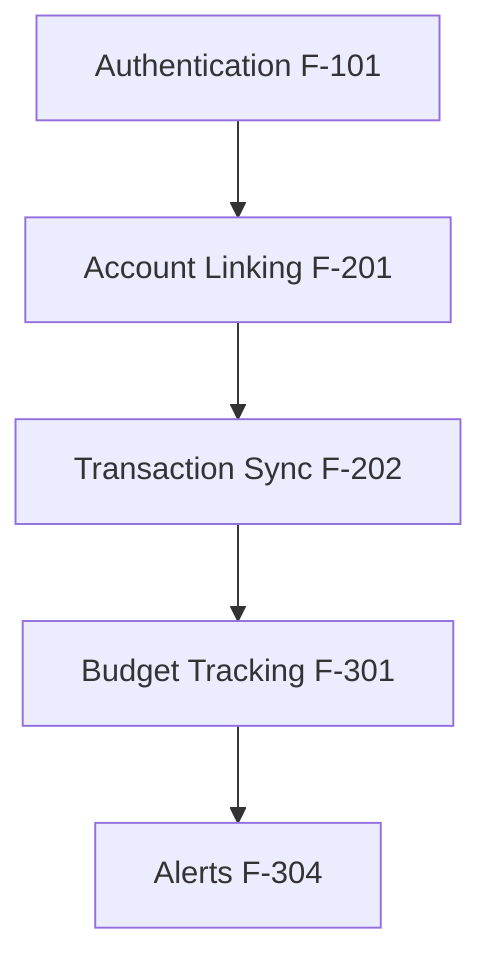

### Integration Points Matrix

| Feature | Dependencies | Shared Services | External Systems |
| --- | --- | --- | --- |
| F-201 | F-101 | Auth Service | Plaid API |
| F-301 | F-202 | Transaction Service | None |
| F-304 | F-301 | Notification Service | Email Provider |

## 2.4 IMPLEMENTATION CONSIDERATIONS

### Technical Requirements Matrix

| Feature ID | Performance Target | Scale Requirements | Security Needs |
| --- | --- | --- | --- |
| F-101 | Auth \< 1s | 100K users | SOC2 compliance |
| F-201 | Sync \< 30s | 10 accounts/user | End-to-end encryption |
| F-301 | Calculate \< 2s | 1000 transactions/month | Data encryption |

### Maintenance Requirements

| Feature | Backup Needs | Update Frequency | Monitoring |
| --- | --- | --- | --- |
| F-201 | Daily backup | Weekly API updates | Connection status |
| F-301 | Real-time sync | Monthly rules update | Performance metrics |
| F-304 | Event logging | Quarterly review | Alert delivery |

# 3. PROCESS FLOWCHART

## 3.1 SYSTEM WORKFLOWS

### Core User Authentication Flow

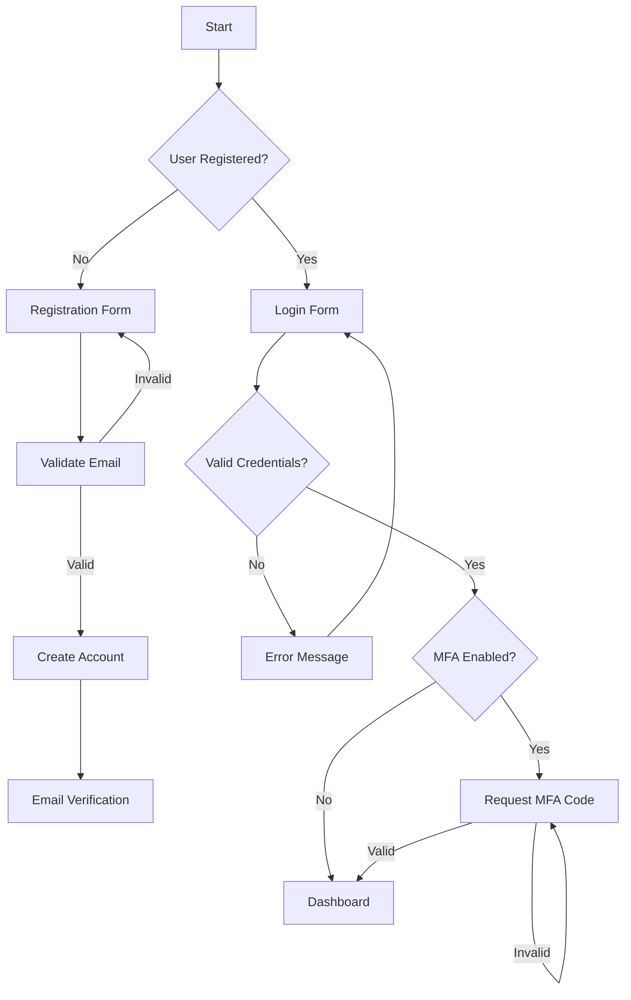

### Account Linking Process

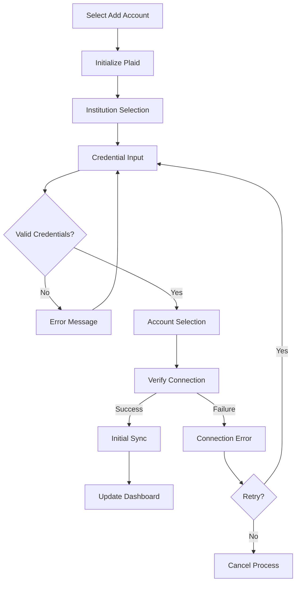

### Transaction Processing Flow

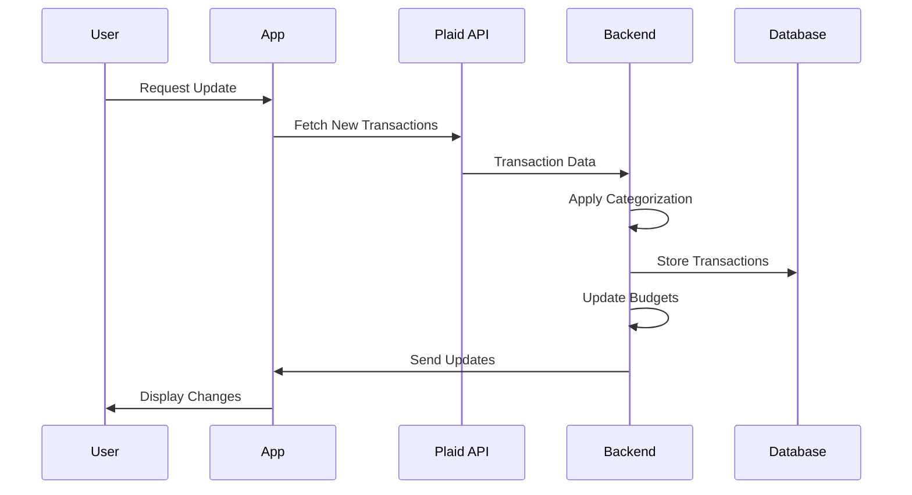

## 3.2 INTEGRATION WORKFLOWS

### Data Synchronization Process

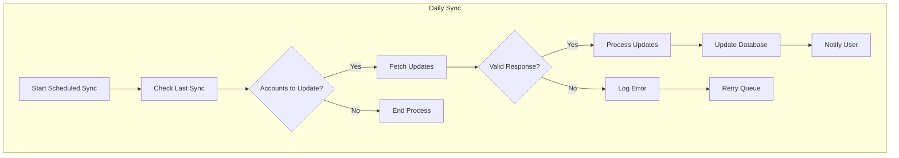

### Error Recovery Flow

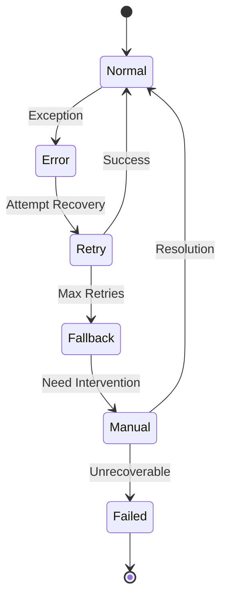

## 3.3 VALIDATION RULES

### Budget Update Process

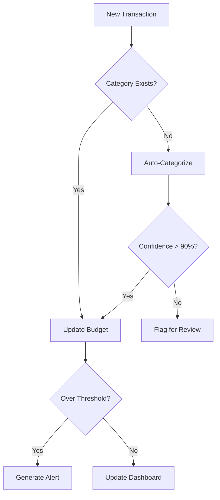

## 3.4 STATE MANAGEMENT

### Investment Transaction States

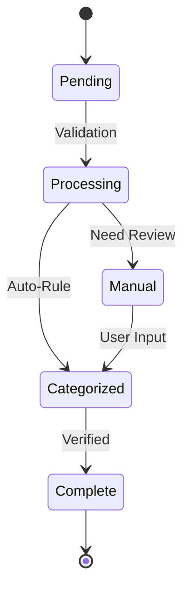

## 3.5 ERROR HANDLING

### Critical Error Recovery

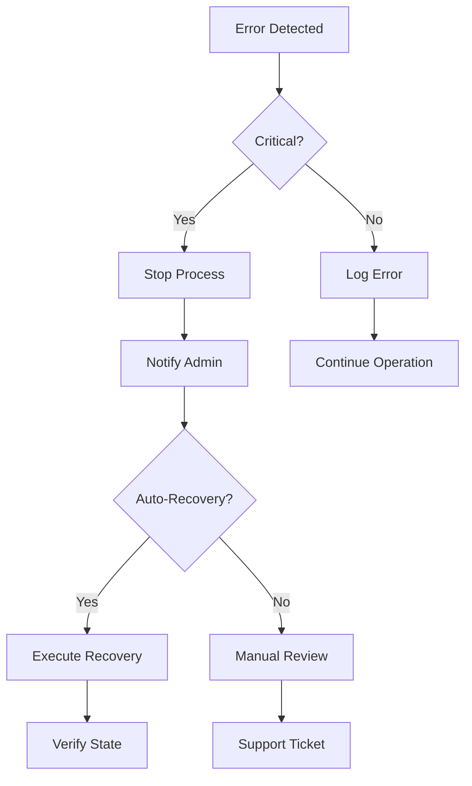

# 4. SYSTEM ARCHITECTURE

## 4.1 HIGH-LEVEL ARCHITECTURE

### System Context Diagram (Level 0)

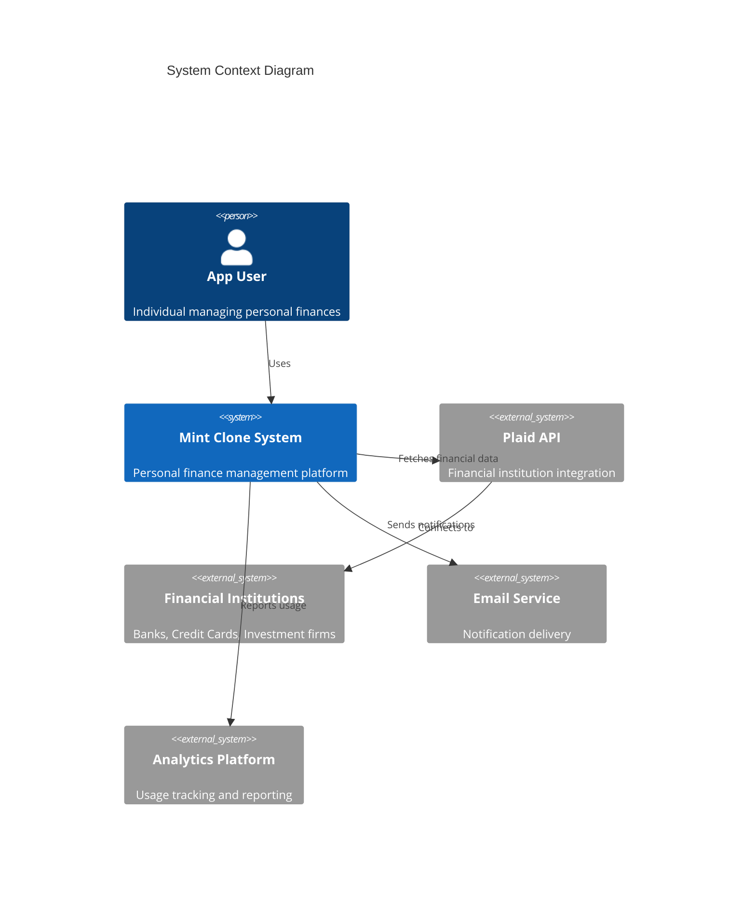

### Container Diagram (Level 1)

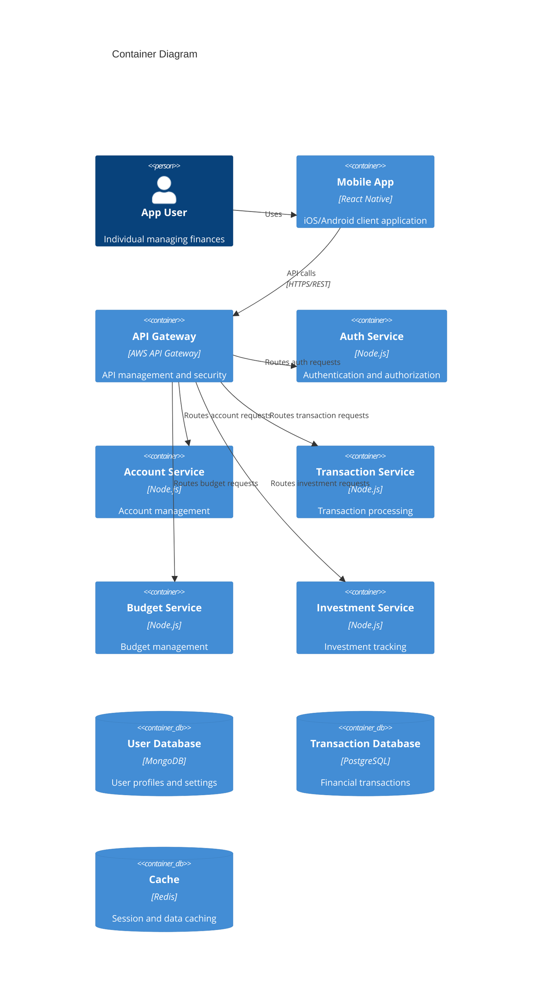

## 4.2 COMPONENT DETAILS

### Service Components Matrix

| Component | Technology | Purpose | Data Store | Scaling Strategy |
| --- | --- | --- | --- | --- |
| API Gateway | AWS API Gateway | Request routing, rate limiting | Redis | Automatic scaling |
| Auth Service | Node.js/Express | User authentication | MongoDB | Horizontal |
| Account Service | Node.js/Express | Account management | MongoDB | Horizontal |
| Transaction Service | Node.js/Express | Transaction processing | PostgreSQL | Horizontal |
| Budget Service | Node.js/Express | Budget tracking | PostgreSQL | Horizontal |
| Investment Service | Node.js/Express | Investment analytics | PostgreSQL | Horizontal |
| Mobile App | React Native | User interface | Local Storage | N/A |

### Data Flow Diagram

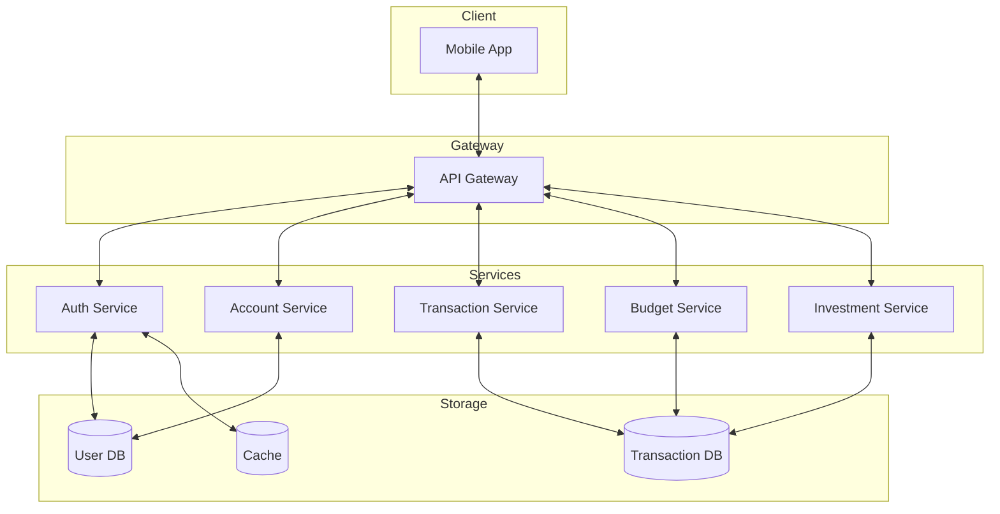

## 4.3 TECHNICAL DECISIONS

### Architecture Choices

| Component | Choice | Justification |
| --- | --- | --- |
| Architecture Style | Microservices | Independent scaling, isolation, maintainability |
| API Design | REST | Industry standard, client compatibility |
| Communication | Synchronous + Event-driven | Real-time updates with async processing |
| Primary Database | PostgreSQL | ACID compliance, transaction support |
| User Database | MongoDB | Flexible schema for user data |
| Caching | Redis | High performance, pub/sub support |

### Deployment Diagram

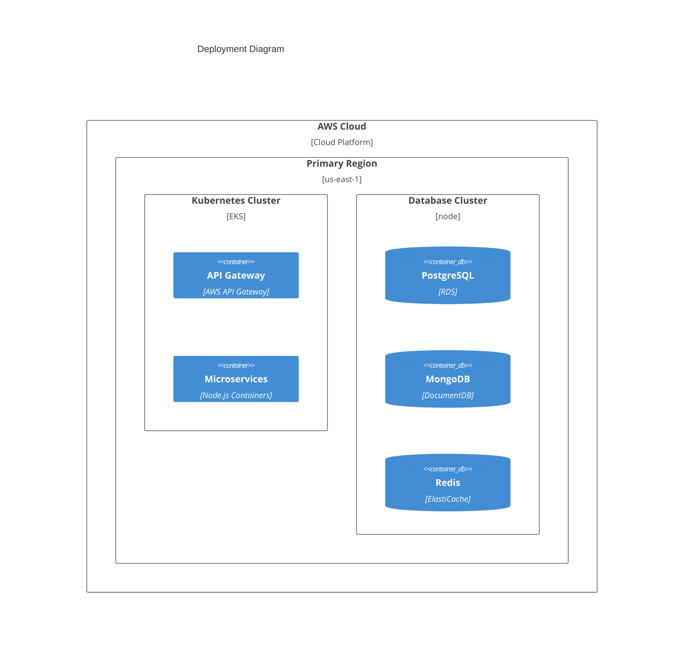

## 4.4 CROSS-CUTTING CONCERNS

### Monitoring and Security Matrix

| Concern | Implementation | Tools |
| --- | --- | --- |
| Monitoring | Distributed tracing | AWS X-Ray, CloudWatch |
| Logging | Centralized logs | ELK Stack |
| Authentication | JWT + OAuth 2.0 | Custom Auth Service |
| Authorization | Role-based access | Custom Auth Service |
| Data Encryption | At rest and in transit | AWS KMS, SSL/TLS |
| Backup | Daily automated | AWS Backup |
| Recovery | Multi-region | Route 53 failover |

### Performance Requirements

| Service | Metric | Target |
| --- | --- | --- |
| API Gateway | Response Time | \< 100ms |
| Auth Service | Authentication | \< 500ms |
| Transaction Service | Processing | \< 1s |
| Budget Service | Calculations | \< 2s |
| Investment Service | Updates | \< 5s |
| Database | Query Time | \< 100ms |
| Cache | Response Time | \< 10ms |

# 5. SYSTEM COMPONENTS DESIGN

## 5.1 CORE SERVICES ARCHITECTURE

### Service Components

| Service | Responsibility | Communication Pattern | Discovery Method |
| --- | --- | --- | --- |
| Auth Service | User authentication, session management | REST/gRPC | AWS Service Discovery |
| Account Service | Financial account management | REST/Event-driven | AWS Service Discovery |
| Transaction Service | Transaction processing, categorization | Event-driven | AWS Service Discovery |
| Budget Service | Budget tracking, alerts | Event-driven | AWS Service Discovery |
| Investment Service | Portfolio tracking, analytics | REST/Event-driven | AWS Service Discovery |

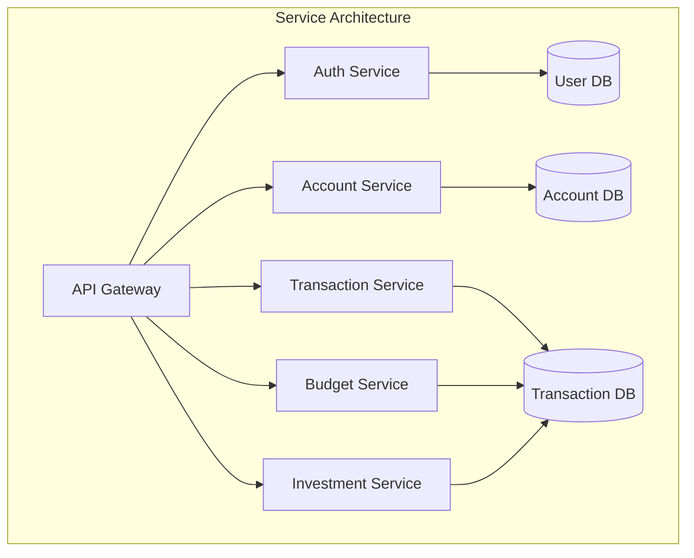

#### Load Balancing Strategy

| Component | Strategy | Health Check | Failover |
| --- | --- | --- | --- |
| API Gateway | Round Robin | TCP/30s | Cross-zone |
| Services | Least Connection | HTTP/15s | Pod rescheduling |
| Databases | Active-Passive | Custom/60s | Automated |

#### Circuit Breaker Configuration

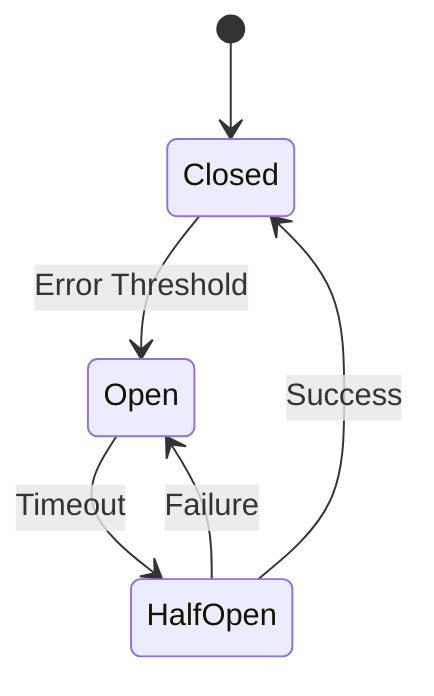

### Scalability Design

| Component | Scaling Type | Triggers | Min/Max |
| --- | --- | --- | --- |
| API Gateway | Horizontal | CPU \> 70% | 2/10 |
| Services | Horizontal | CPU \> 75%, Memory \> 80% | 2/8 |
| Databases | Vertical + Read Replicas | Connection count \> 1000 | N/A |

### Resilience Patterns

| Pattern | Implementation | Recovery Time |
| --- | --- | --- |
| Circuit Breaker | Hystrix | 30s timeout |
| Retry | Exponential backoff | Max 3 attempts |
| Fallback | Static responses | Immediate |
| Bulkhead | Thread pool isolation | N/A |

## 5.2 DATABASE DESIGN

### Schema Design

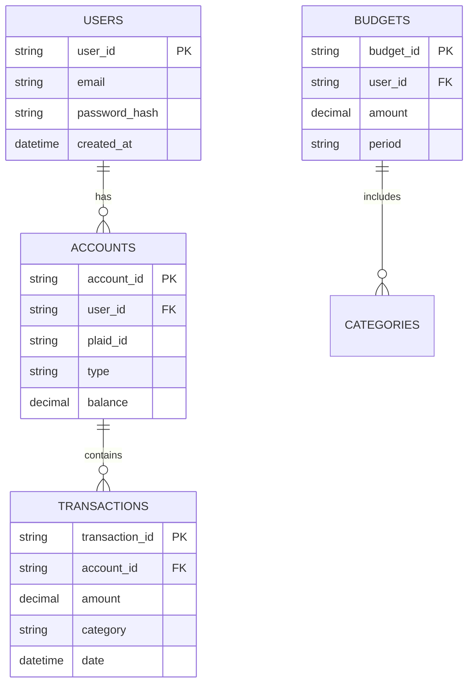

#### Indexing Strategy

| Table | Index Type | Columns | Purpose |
| --- | --- | --- | --- |
| Users | Primary | user_id | Lookup |
| Users | Unique | email | Authentication |
| Transactions | Primary | transaction_id | Lookup |
| Transactions | Composite | (account_id, date) | Filtering |
| Accounts | Primary | account_id | Lookup |

### Data Management

| Aspect | Strategy | Retention |
| --- | --- | --- |
| Backups | Daily snapshots | 30 days |
| Archives | Monthly compression | 7 years |
| Audit Logs | Continuous | 1 year |
| User Data | On-demand export | N/A |

## 5.3 INTEGRATION ARCHITECTURE

### API Design

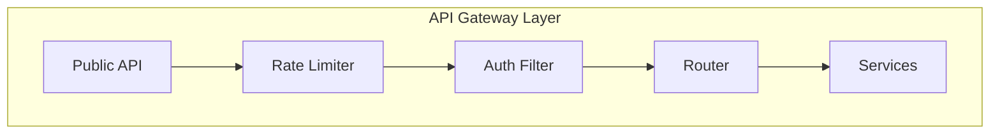

#### API Specifications

| Endpoint Type | Authentication | Rate Limit |
| --- | --- | --- |
| Public | API Key | 100/min |
| User | JWT | 1000/min |
| Admin | JWT + MFA | 50/min |

### Message Processing

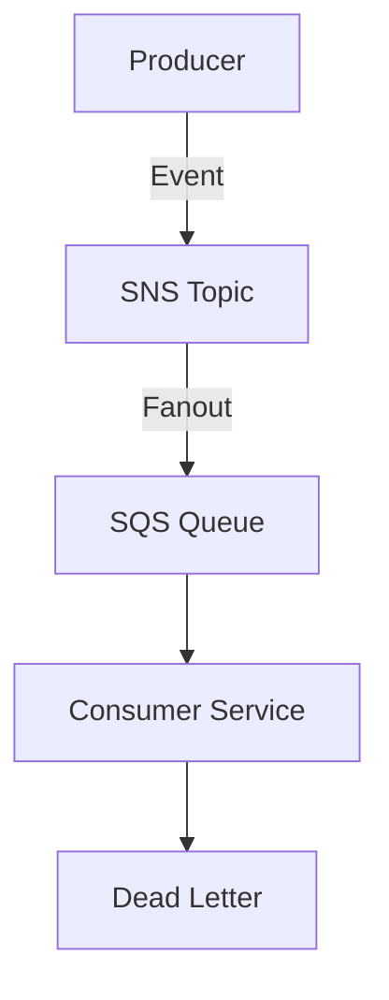

### External Systems

| System | Integration Type | SLA |
| --- | --- | --- |
| Plaid | REST API | 99.9% |
| Email Service | SMTP | 99.5% |
| Analytics | Batch ETL | 99% |

## 5.4 SECURITY ARCHITECTURE

### Authentication Framework

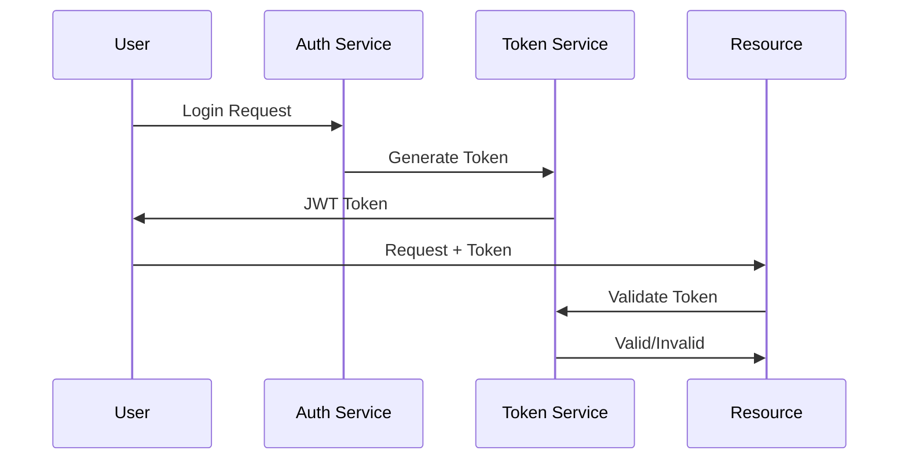

### Authorization System

| Resource | Roles | Permissions |
| --- | --- | --- |
| Accounts | Owner, Viewer | Read, Write |
| Transactions | Owner | Read |
| Budgets | Owner | Read, Write |
| Reports | Owner, Viewer | Read |

### Data Protection

| Layer | Encryption | Key Management |
| --- | --- | --- |
| Rest | AES-256 | AWS KMS |
| Transit | TLS 1.3 | ACM |
| Backup | AES-256 | AWS KMS |

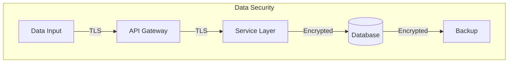

# 6. TECHNOLOGY STACK

## 6.1 PROGRAMMING LANGUAGES

| Layer | Language | Version | Justification |
| --- | --- | --- | --- |
| Mobile Frontend | TypeScript | 4.9+ | Type safety, React Native compatibility |
| Backend Services | Node.js | 18 LTS | Event-driven architecture, microservices support |
| Database Scripts | Python | 3.11+ | Data processing, ETL operations |
| DevOps | Go | 1.19+ | Infrastructure tooling, performance |

### Language Selection Criteria Matrix

| Requirement | Selected Solution | Reasoning |
| --- | --- | --- |
| Mobile Development | TypeScript/React Native | Cross-platform, code reuse |
| API Services | Node.js/Express | Async I/O, large ecosystem |
| Data Processing | Python | Rich libraries, data analysis |
| System Tools | Go | Performance, concurrent operations |

## 6.2 FRAMEWORKS & LIBRARIES

### Core Frameworks

| Component | Framework | Version | Purpose |
| --- | --- | --- | --- |
| Mobile App | React Native | 0.71+ | Cross-platform mobile development |
| State Management | Redux Toolkit | 1.9+ | Centralized state management |
| API Layer | Express.js | 4.18+ | RESTful API implementation |
| Authentication | Passport.js | 0.6+ | Auth middleware |
| Testing | Jest | 29+ | Unit and integration testing |

### Supporting Libraries

```mermaid
graph TD
    A[React Native] --> B[Redux]
    A --> C[React Navigation]
    A --> D[React Native Charts]
    B --> E[Redux Toolkit]
    B --> F[Redux Persist]
```

## 6.3 DATABASES & STORAGE

### Database Architecture

| Type | Technology | Version | Usage |
| --- | --- | --- | --- |
| Primary DB | PostgreSQL | 14+ | Transactional data |
| User DB | MongoDB | 6.0+ | User profiles |
| Cache | Redis | 7.0+ | Session management |
| Search | Elasticsearch | 8.0+ | Transaction search |

### Storage Strategy

```mermaid
flowchart TD
    A[Application Data] --> B{Data Type}
    B -->|Transactional| C[PostgreSQL]
    B -->|User Profile| D[MongoDB]
    B -->|Session| E[Redis]
    B -->|Search| F[Elasticsearch]
```

## 6.4 THIRD-PARTY SERVICES

### External Services Matrix

| Service | Provider | Purpose | SLA |
| --- | --- | --- | --- |
| Financial Data | Plaid | Account aggregation | 99.9% |
| Email | AWS SES | Notifications | 99.9% |
| SMS | Twilio | MFA | 99.9% |
| Monitoring | DataDog | System monitoring | 99.9% |
| Analytics | Mixpanel | User analytics | 99.5% |

### Integration Architecture

```mermaid
graph TD
    subgraph External Services
        A[Plaid API]
        B[AWS Services]
        C[Twilio]
        D[DataDog]
    end
    
    subgraph Application
        E[API Gateway]
        F[Services]
        G[Monitoring]
    end
    
    E --> A
    E --> B
    F --> C
    G --> D
```

## 6.5 DEVELOPMENT & DEPLOYMENT

### Development Environment

| Tool | Version | Purpose |
| --- | --- | --- |
| VS Code | Latest | IDE |
| Docker | 20.10+ | Containerization |
| Kubernetes | 1.25+ | Container orchestration |
| GitHub Actions | N/A | CI/CD |

### Deployment Pipeline

```mermaid
flowchart LR
    A[Code Push] --> B[Build]
    B --> C[Test]
    C --> D[Security Scan]
    D --> E{Quality Gate}
    E -->|Pass| F[Deploy Staging]
    F --> G[Integration Tests]
    G -->|Pass| H[Deploy Prod]
    E -->|Fail| I[Notify Team]
```

### Infrastructure Configuration

| Component | Technology | Configuration |
| --- | --- | --- |
| IaC | Terraform | AWS resources |
| Containers | Docker | Microservices |
| Orchestration | EKS | Production deployment |
| Registry | ECR | Container images |

### Build System Requirements

| Phase | Tool | Configuration |
| --- | --- | --- |
| Lint | ESLint | Airbnb preset |
| Test | Jest | 80% coverage |
| Build | Webpack | Production optimization |
| Deploy | ArgoCD | GitOps workflow |

# 7. USER INTERFACE DESIGN

## 7.1 WIREFRAME SYMBOL KEY

```
NAVIGATION & MENUS
[#] - Dashboard/Home
[=] - Menu
[<] - Back
[>] - Forward
[@] - Profile
[?] - Help

ACTIONS
[+] - Add new
[x] - Close/Delete
[^] - Upload
[$] - Financial transaction
[!] - Alert/Warning
[*] - Favorite/Important

INPUT ELEMENTS
[...] - Text input field
[ ] - Checkbox
( ) - Radio button
[v] - Dropdown menu
[Button] - Action button
[====] - Progress bar
```

## 7.2 CORE SCREENS

### 7.2.1 Login Screen

```
+----------------------------------------+
|              Mint Clone                 |
|                                        |
|          [@] Login to Account          |
|                                        |
|    Email:    [.....................]   |
|    Password: [.....................]   |
|                                        |
|    [ ] Remember this device            |
|                                        |
|         [    Login    ]                |
|                                        |
|    [?] Forgot Password                 |
|    [+] Create Account                  |
|                                        |
+----------------------------------------+
```

### 7.2.2 Main Dashboard

```
+----------------------------------------+
| [=] Mint Clone              [@] [?] [!]|
+----------------------------------------+
| Net Worth: $52,450                     |
| +----------------------------------+   |
| |     Assets         Debts         |   |
| |    $65,200       $12,750        |   |
| +----------------------------------+   |
|                                        |
| ACCOUNTS                       [+] Add |
| +----------------------------------+   |
| | Checking         $ 4,250    [$] |   |
| | Savings          $12,300    [$] |   |
| | Credit Card      -$2,750    [$] |   |
| | Investment       $48,650    [$] |   |
| +----------------------------------+   |
|                                        |
| BUDGETS                        [>]     |
| [====] Groceries    $450/$600         |
| [===]  Transport    $180/$200         |
| [======] Shopping   $600/$500 [!]     |
|                                        |
| RECENT TRANSACTIONS             [>]    |
| | Walmart          -$54.23     |      |
| | Chevron         -$45.00     |      |
| | Amazon          -$128.50    |      |
+----------------------------------------+
```

### 7.2.3 Account Connection

```
+----------------------------------------+
| [<] Connect Account          [x] Close |
+----------------------------------------+
|                                        |
| Select Your Bank:                      |
| [...Search institutions.............]  |
|                                        |
| POPULAR BANKS                          |
| ( ) Chase                             |
| ( ) Bank of America                   |
| ( ) Wells Fargo                       |
| ( ) Citibank                          |
|                                        |
| [    Continue    ]                     |
|                                        |
| [?] Need help finding your bank?      |
+----------------------------------------+
```

### 7.2.4 Budget Creation

```
+----------------------------------------+
| [<] Create Budget           [x] Close  |
+----------------------------------------+
|                                        |
| Category: [v] Select Category         |
|           - Housing                    |
|           - Transportation            |
|           - Food & Dining             |
|                                        |
| Monthly Amount: [$...............]     |
|                                        |
| Alert Threshold:                       |
| [====================================] |
|  0%   25%   50%   75%   90%   100%    |
|                                        |
| Notification Settings:                 |
| [x] Email alerts                       |
| [x] Push notifications                 |
|                                        |
| [    Create Budget    ]                |
+----------------------------------------+
```

### 7.2.5 Investment Dashboard

```
+----------------------------------------+
| [<] Investments             [@] [?] [=]|
+----------------------------------------+
| Portfolio Value: $48,650               |
| +----------------------------------+   |
| |    Growth     Risk     Return    |   |
| |    +8.2%     Moderate   6.5%     |   |
| +----------------------------------+   |
|                                        |
| ALLOCATION                      [>]    |
| +----------------------------------+   |
| | Stocks    [========]  80%  [$]  |   |
| | Bonds     [==]       15%  [$]  |   |
| | Cash      [=]         5%  [$]  |   |
| +----------------------------------+   |
|                                        |
| PERFORMANCE                     [>]    |
| 1D    +$125.30    +0.25%             |
| 1W    +$840.50    +1.75%             |
| 1M    +$2,250     +4.85%             |
| YTD   +$4,650     +9.90%             |
|                                        |
| [    Add Investment    ]              |
+----------------------------------------+
```

## 7.3 RESPONSIVE DESIGN BREAKPOINTS

| Device | Width | Layout Adjustments |
| --- | --- | --- |
| Mobile S | 320px | Single column, stacked cards |
| Mobile L | 425px | Single column, larger touch targets |
| Tablet | 768px | Two column layout, side menu |
| Desktop | 1024px+ | Full layout, expanded charts |

## 7.4 INTERACTION PATTERNS

### Navigation Flow

```
[#] Dashboard
 +-- [$] Accounts
 |   +-- [+] Add Account
 |   +-- [v] Transaction History
 +-- [$] Budgets
 |   +-- [+] Create Budget
 |   +-- [!] Alerts
 +-- [$] Investments
 |   +-- Performance
 |   +-- Holdings
 +-- [@] Profile
     +-- Settings
     +-- Security
     +-- Support
```

### Common Actions

```
Add Account:
[+] -> Select Bank -> Login -> Select Accounts -> Confirm

Create Budget:
[$] -> Select Category -> Set Amount -> Configure Alerts

View Transaction:
[$] -> Select Account -> Transaction List -> Details

Investment Analysis:
[$] -> Select Portfolio -> View Performance -> Adjust Holdings
```

# 8. INFRASTRUCTURE

## 8.1 DEPLOYMENT ENVIRONMENT

### Environment Matrix

| Environment | Purpose | Infrastructure | Scaling |
| --- | --- | --- | --- |
| Development | Feature development, testing | AWS EKS (dev cluster) | Manual |
| Staging | Pre-production validation | AWS EKS (staging cluster) | Auto-scaling |
| Production | Live application | AWS EKS (prod cluster) | Auto-scaling |
| DR | Disaster recovery | AWS EKS (secondary region) | Standby |

### Regional Distribution

```mermaid
graph TD
    subgraph Primary Region
        A[US-East-1]
        A --> B[Production]
        A --> C[Staging]
    end
    
    subgraph DR Region
        D[US-West-2]
        D --> E[DR Environment]
    end
    
    subgraph Edge
        F[CloudFront CDN]
    end
    
    F --> A
    F --> D
```

## 8.2 CLOUD SERVICES

### AWS Service Configuration

| Service | Usage | Configuration | Scaling Policy |
| --- | --- | --- | --- |
| EKS | Container orchestration | 1.25+ | Node autoscaling |
| RDS | PostgreSQL database | Multi-AZ | Storage autoscaling |
| DocumentDB | MongoDB compatible | Multi-AZ | Compute scaling |
| ElastiCache | Redis caching | Cluster mode | Memory scaling |
| S3 | Object storage | Standard tier | N/A |
| CloudFront | CDN | Edge locations | Auto |
| Route 53 | DNS management | Active-active | N/A |
| KMS | Key management | Customer managed | N/A |

### Network Architecture

```mermaid
graph TD
    subgraph VPC
        A[Public Subnet]
        B[Private Subnet]
        C[Data Subnet]
        
        A --> D[NAT Gateway]
        D --> B
        B --> C
        
        E[ALB] --> A
        F[EKS Nodes] --> B
        G[Databases] --> C
    end
```

## 8.3 CONTAINERIZATION

### Container Strategy

| Component | Base Image | Resource Limits |
| --- | --- | --- |
| API Services | node:18-alpine | CPU: 1, Memory: 2Gi |
| Auth Service | node:18-alpine | CPU: 0.5, Memory: 1Gi |
| Workers | node:18-alpine | CPU: 0.5, Memory: 1Gi |
| Monitoring | grafana/grafana | CPU: 0.5, Memory: 1Gi |

### Docker Configuration

```mermaid
graph LR
    subgraph Container Architecture
        A[Base Image] --> B[Build Stage]
        B --> C[Runtime Stage]
        C --> D[Production Image]
    end
```

## 8.4 ORCHESTRATION

### Kubernetes Configuration

| Resource | Purpose | Scaling Strategy |
| --- | --- | --- |
| Deployments | Service containers | HPA based on CPU/Memory |
| StatefulSets | Databases | Manual scaling |
| DaemonSets | Monitoring agents | Node-based |
| ConfigMaps | Configuration | N/A |
| Secrets | Sensitive data | N/A |

### Cluster Architecture

```mermaid
graph TD
    subgraph EKS Cluster
        A[Control Plane] --> B[Node Group 1]
        A --> C[Node Group 2]
        
        B --> D[App Pods]
        C --> E[Service Pods]
        
        F[Ingress Controller] --> D
        F --> E
    end
```

## 8.5 CI/CD PIPELINE

### Pipeline Stages

```mermaid
graph LR
    A[Code Push] --> B[Build]
    B --> C[Unit Tests]
    C --> D[Security Scan]
    D --> E[Build Image]
    E --> F[Deploy to Dev]
    F --> G[Integration Tests]
    G --> H[Deploy to Staging]
    H --> I[E2E Tests]
    I --> J[Deploy to Prod]
```

### Deployment Configuration

| Stage | Tool | Configuration | Validation |
| --- | --- | --- | --- |
| Source Control | GitHub | Branch protection | Status checks |
| CI | GitHub Actions | Matrix builds | Test coverage |
| Registry | ECR | Image scanning | CVE checks |
| CD | ArgoCD | GitOps | Health checks |
| Monitoring | Prometheus | Custom metrics | Alerts |

### Environment Promotion

```mermaid
stateDiagram-v2
    [*] --> Development
    Development --> Staging: Tests Pass
    Staging --> Production: Approval
    Production --> DR: Sync
    Development --> [*]: Fail
    Staging --> Development: Fail
```

# APPENDICES

## A.1 ADDITIONAL TECHNICAL INFORMATION

### A.1.1 Data Retention Policies

| Data Type | Retention Period | Storage Location | Archival Strategy |
| --- | --- | --- | --- |
| Transaction History | 7 years | PostgreSQL | Yearly compression |
| User Activity Logs | 1 year | MongoDB | Monthly archival |
| Authentication Logs | 90 days | MongoDB | Weekly backup |
| Error Logs | 30 days | CloudWatch | Daily aggregation |
| Analytics Data | 2 years | S3 | Quarterly archival |

### A.1.2 Error Code Matrix

| Code Range | Category | Handling Strategy | User Message |
| --- | --- | --- | --- |
| 1000-1999 | Authentication | Retry with backoff | "Please try logging in again" |
| 2000-2999 | Account Connection | Plaid error mapping | "Unable to connect to institution" |
| 3000-3999 | Transaction | Data validation | "Transaction processing error" |
| 4000-4999 | Budget | State verification | "Budget update failed" |
| 5000-5999 | Investment | Calculation retry | "Investment data unavailable" |

### A.1.3 API Rate Limits

```mermaid
graph TD
    A[Request] --> B{Rate Check}
    B -->|Within Limit| C[Process]
    B -->|Exceeded| D[Throttle]
    D --> E[429 Response]
    C --> F[200 Response]
```

| API Endpoint | Rate Limit | Window | Burst Allowance |
| --- | --- | --- | --- |
| Authentication | 5 | 1 minute | None |
| Account Operations | 30 | 1 minute | 5 |
| Transactions | 100 | 1 minute | 20 |
| Investment Data | 50 | 1 minute | 10 |
| Budget Updates | 30 | 1 minute | 5 |

## A.2 GLOSSARY

| Term | Definition |
| --- | --- |
| Net Worth | Total assets minus total liabilities |
| Portfolio Allocation | Distribution of investments across different asset classes |
| Transaction Categorization | Automated process of classifying financial transactions |
| Budget Threshold | Predefined spending limit for a budget category |
| Financial Institution | Bank, credit union, or investment company holding user accounts |
| Account Aggregation | Process of collecting financial data from multiple sources |
| Investment Performance | Measurement of investment returns over time |
| Goal Tracking | Monitoring progress towards financial objectives |
| Manual Reconciliation | User-driven process to correct transaction categorization |
| Data Synchronization | Process of updating financial data from institutions |

## A.3 ACRONYMS

| Acronym | Full Form |
| --- | --- |
| API | Application Programming Interface |
| AWS | Amazon Web Services |
| CDN | Content Delivery Network |
| CSV | Comma Separated Values |
| DR | Disaster Recovery |
| EKS | Elastic Kubernetes Service |
| ETL | Extract, Transform, Load |
| HTTPS | Hypertext Transfer Protocol Secure |
| JWT | JSON Web Token |
| KMS | Key Management Service |
| MFA | Multi-Factor Authentication |
| OAuth | Open Authorization |
| REST | Representational State Transfer |
| S3 | Simple Storage Service |
| SLA | Service Level Agreement |
| SSL | Secure Sockets Layer |
| TLS | Transport Layer Security |
| UI | User Interface |
| VPC | Virtual Private Cloud |
| YTD | Year to Date |

## A.4 COMPLIANCE REQUIREMENTS

```mermaid
graph TD
    A[Compliance Requirements] --> B[Data Security]
    A --> C[Privacy]
    A --> D[Reporting]
    
    B --> E[Encryption]
    B --> F[Access Control]
    
    C --> G[Data Handling]
    C --> H[User Consent]
    
    D --> I[Audit Logs]
    D --> J[Monitoring]
```

| Requirement | Standard | Implementation |
| --- | --- | --- |
| Data Security | SOC2 | AWS KMS, VPC |
| Privacy | GDPR/CCPA | Data encryption, consent management |
| Financial | PSD2 | Secure authentication, transaction monitoring |
| Operational | ISO 27001 | Security controls, incident management |
| Reporting | FINRA | Audit trails, compliance reporting |