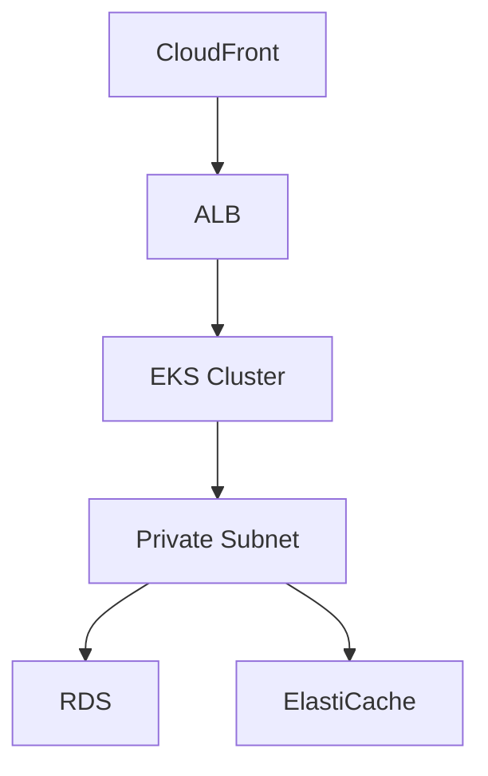

# Mint Clone Infrastructure Documentation

Comprehensive infrastructure documentation for the Mint Clone personal financial management platform, detailing setup, deployment, monitoring, and maintenance procedures.

## Table of Contents
- [Prerequisites](#prerequisites)
- [Infrastructure Overview](#infrastructure-overview)
- [Environment Setup](#environment-setup)
- [Deployment Guide](#deployment-guide)
- [Monitoring & Logging](#monitoring--logging)
- [Security](#security)
- [Maintenance](#maintenance)
- [Troubleshooting](#troubleshooting)

## Prerequisites

### Required Tools
- Terraform v1.0.0+
- kubectl v1.25+
- Helm v3.0+
- AWS CLI v2.0+
- Docker v20.10+

### Required Credentials
- AWS IAM credentials with administrative access
- GitHub repository access
- Docker registry credentials
- PagerDuty API keys for alerting

## Infrastructure Overview

### Architecture Components
- VPC with public, private, and database subnets
- EKS cluster for container orchestration
- RDS PostgreSQL for transactional data
- ElastiCache Redis for caching
- Route 53 for DNS management
- CloudFront for CDN
- S3 for object storage

### Network Architecture


## Environment Setup

### Development Environment
1. Clone the infrastructure repository
2. Install required tools and dependencies
3. Configure AWS credentials
4. Initialize Terraform workspace:
```bash
terraform init -backend-config="environment=dev"
```

### Production Environment
1. Ensure all prerequisites are met
2. Configure production AWS credentials
3. Initialize Terraform workspace:
```bash
terraform init -backend-config="environment=prod"
```

## Deployment Guide

### Infrastructure Deployment
1. Review and update terraform.tfvars
2. Plan the deployment:
```bash
terraform plan -var-file="env/prod.tfvars"
```
3. Apply the configuration:
```bash
terraform apply -var-file="env/prod.tfvars"
```

### Application Deployment
1. Configure kubectl context:
```bash
aws eks update-kubeconfig --name mint-clone-prod
```
2. Deploy core components:
```bash
./scripts/init-cluster.sh prod
```
3. Deploy monitoring stack:
```bash
./scripts/deploy-monitoring.sh prod
```

## Monitoring & Logging

### Prometheus Setup
- Metrics retention: 15 days
- Storage: 50GB
- Scrape interval: 15s
- Access: https://prometheus.mint-clone.com

### AlertManager Configuration
- Notification channels: Email, PagerDuty
- Severity levels: Critical, Warning, Info
- Access: https://alertmanager.mint-clone.com

### Logging Stack
- EFK (Elasticsearch, Fluentd, Kibana)
- Log retention: 30 days
- Access: https://kibana.mint-clone.com

## Security

### Network Security
- VPC isolation with private subnets
- Security groups for service isolation
- Network policies for pod-to-pod communication
- TLS termination at ingress

### Access Control
- RBAC for Kubernetes resources
- IAM roles for service accounts
- Secrets management with AWS Secrets Manager
- Pod security policies enabled

## Maintenance

### Backup Procedures
- RDS automated backups: Daily
- EBS volume snapshots: Daily
- Terraform state backup: Every apply
- Retention period: 30 days

### Scaling Procedures
1. Update terraform.tfvars with new capacity
2. Run Terraform plan/apply
3. Verify cluster health
4. Monitor resource utilization

### Update Procedures
1. Review change log and impact
2. Create maintenance window
3. Apply updates using Terraform
4. Verify system health
5. Update documentation

## Troubleshooting

### Common Issues
1. Pod scheduling failures
   - Check node resources
   - Verify node selectors
   - Review pod events

2. Service connectivity issues
   - Verify security groups
   - Check DNS resolution
   - Review service endpoints

3. Monitoring alerts
   - Check service logs
   - Review metrics
   - Verify alert conditions

### Support Contacts
- Infrastructure Team: infra@mintclone.com
- Security Team: security@mintclone.com
- On-call Support: oncall@mintclone.com

### Useful Commands
```bash
# Check cluster health
kubectl get nodes
kubectl top nodes

# View pod logs
kubectl logs -f deployment/service-name

# Check monitoring status
kubectl -n monitoring get pods

# Verify alerting
kubectl -n monitoring port-forward svc/alertmanager 9093:9093
```

## Reference Documentation
- [AWS EKS Documentation](https://docs.aws.amazon.com/eks/)
- [Terraform AWS Provider](https://registry.terraform.io/providers/hashicorp/aws/latest/docs)
- [Prometheus Operator](https://prometheus-operator.dev/)
- [AlertManager Configuration](https://prometheus.io/docs/alerting/latest/configuration/)